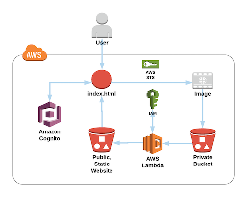

# S3 Image Upload and Watermark

- Uses AWS Lambda and an S3 Trigger to convert original images to resized, watermarked images.
- Also includes a simple static HTML/JS website to upload and display images.



## How to use

### Get the code

- Use `svn export https://github.com/DeMoehn/aws-templates/trunk/lambda/lambda-s3-image-upload-and-watermark` to download the contents

### Create with CloudFormation template

#### This CloudFormation creates

- An IAM role for basic Lambda Execution and S3 Access: *"lambda_<ENVIRONMENT_NAME>_role"*
- A private, SSE AES256 encrypted S3 Bucket: *"<ENVIRONMENT_NAME>-private-<AWS_ACCOUNT-ID>"*
- A public accessible, static-website S3 Bucket: *"<ENVIRONMENT_NAME>-public-<AWS_ACCOUNT-ID>"*
- A Cognito Identity Pool: *"identityPool_<ENVIRONMENT_NAME>"*
- An IAM role for Cognito with write access to the private S3 Bucket and read access from the public S3 Bucket: *"CognitoUnauth_<ENVIRONMENT_NAME>_role"*
- The AWS Lambda Function: *"lambda_<ENVIRONMENT_NAME>"*

#### Use the following commands

##### Setting up the Lambda

- Go to the Folder *"lambda_function/"* and open a new Terminal
- Run `npm install` to install all the dependencies of the function

##### Setting up the CloudFormation

- Go to the Folder *"cloudformation/"* and start a new Terminal
- Use the code below to package the CloudFormation template
- Replace \<S3_LAMBDA_BUCKET> with an existing Bucket that can store the Lambda files (otherwise use `aws s3 mb s3://<S3_LAMBDA_BUCKET>` to create a new one)

``` bash
aws cloudformation package --template-file lambda_and_static.yaml \
--s3-bucket <S3_LAMBDA_BUCKET> \
--output-template-file packaged-template.yaml
```

- Now create the stack in AWS
- Replace \<STACK_NAME> and \<ENVIRONMENT_NAME_LOWERCASE> <small>(Environment Name needs to be lowercase only '[a-z]+')</small>

``` bash
aws cloudformation deploy --stack-name <STACK_NAME> \
--template-file packaged-template.yaml  \
--parameter-overrides EnvironmentName=<ENVIRONMENT_NAME_LOWERCASE> \
--capabilities CAPABILITY_NAMED_IAM
```

- You should see something like "Successfully created/updated stack - <STACK_NAME>" after a while
- Use `aws cloudformation describe-stacks --stack-name <STACK_NAME>` to see an overview with the progress and output of your stack

### Optional: Upload the Static Website

- Go to the *"static_website/"* Folder and open *"config.example.js"*
- Enter all the needed Information <small>(You can find all the information in your CloudFormation Output)</small>
- Now rename the File from *"config.example.js"* to *"config.js"* <small>(Remove: ".example")</small>
- Go to the Folder *"static_website/"* and open a new Terminal window
- Use: `aws s3 cp . s3://<StaticWebsiteBucketName> --recursive` to upload all Files in the Folder to the Static Website S3 Bucket <small>(You may use `--dryrun` first if you're not sure if you're in the right directory)</small>
- You can now access the Static Website via the *"StaticWebsiteURL"* <small>(You can find the URL in your CloudFormation Output or use: *"http://\<BUCKET-NAME>.s3-website.\<REGION>.amazonaws.com"*)</small> 

