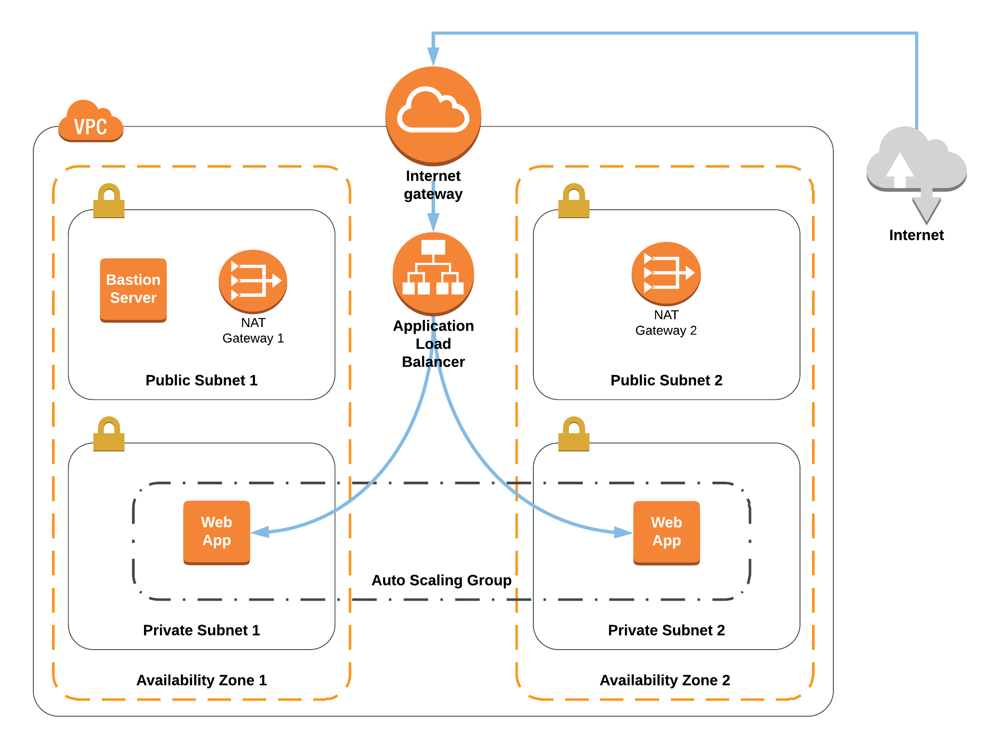
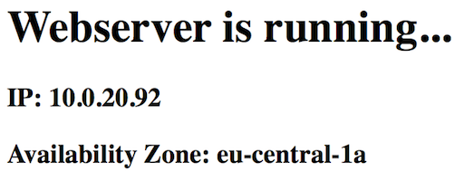

# Cloudformation: AutoScaleWebServers
Deploys a VPC with 4 Subnets (2 Public, 2 Private), 2 NATs, 1 IGW as well as 1 Bastion host (public subnet) and an ALB redirecting traffic to min. 2 autoscaled Webserver Instances in the private Subnets

## Architecture


## How to use

- Replace <STACK_NAME> and <ENVIRONMENT_NAME> to deploy the VPC inkl. Subnets, Route Tables & Internet Gateway

``` bash
aws cloudformation create-stack --stack-name <STACK_NAME> \
--template-body file://VPC_4Subnets_2SGs.yaml \
--parameters ParameterKey=EnvironmentName,ParameterValue=<ENVIRONMENT_NAME>
```

- If you deploy the whole architecture, you need to provide a <KEY-PAIR_NAME> as well

``` bash
aws cloudformation create-stack --stack-name <STACK_NAME> \
--template-body file://VPC_Subnets_Autoscale-WebServers.yaml \
--parameters ParameterKey=EnvironmentName,ParameterValue=<ENVIRONMENT_NAME> ParameterKey=KeyName,ParameterValue=<KEY-PAIR_NAME>
```

- You can access the ALB via the *"LoadBalancerDNS"*

