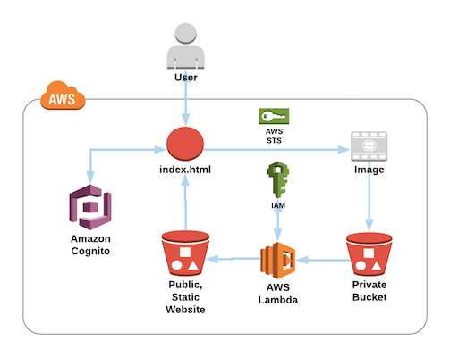
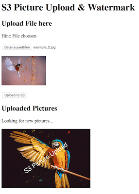

# S3 Image Upload and Watermark

- Uses AWS Lambda and an S3 Trigger to convert original images to resized, watermarked images.
- Also includes a simple static HTML/JS website to upload and display images.



## How to use

### Before we start

You can either use:

1. Only the Lambda, including: 1 AWS Lambda Function, 2 S3 Buckets, 1 IAM Policy, where you manually put objects in the S3 Bucket and the Lambda converts them. (lambda_only.yaml)
2. The Lambda with a static-website: adding AWS Cognito + another IAM role, allowing you to upload & view the image in the Browser. (lambda_and_static.yaml)

You need to decide between 1. or 2. and then pick the right CloudFormation template / steps to follow.

### CloudFormation Templates / Steps

#### This CloudFormation creates:

- An IAM role for basic Lambda Execution and S3 Access: *"lambda_<ENVIRONMENT_NAME>_role"*
- A private, SSE AES256 encrypted S3 Bucket: *"<ENVIRONMENT_NAME>-private-<AWS_ACCOUNT-ID>"*
- A public accessible, static-website S3 Bucket: *"<ENVIRONMENT_NAME>-public-<AWS_ACCOUNT-ID>"*
- A Cognito Identity Pool *(only with lambda_and_static.yaml)*
- An IAM role for Cognito with write access to the private S3 Bucket and read access from the public S3 Bucket *(only with lambda_and_static.yaml)*

#### Use the following commands:

- Go to the Folder *"cloudformation/"* and start a new Terminal
- Use the code below to create the CloudFormation stack (or use the AWS Console UI)
- Use `lambda_only.yaml` or `lambda_and_static.yaml` to replace <CF_FILE>
- Replace \<STACK_NAME> and \<ENVIRONMENT_NAME_LOWERCASE> <small>(Environment Name needs to be lowercase, and only use: aA-)</small>
- Code:

``` bash
aws cloudformation create-stack --stack-name <STACK_NAME> \
--template-body file://<CF_FILE> \
--parameters ParameterKey=EnvironmentName,ParameterValue=<ENVIRONMENT_NAME_LOWERCASE> \
--capabilities CAPABILITY_NAMED_IAM
```

- Use `aws cloudformation describe-stacks --stack-name <STACK_NAME>` to see the progress of your stack
- When finished, you should see a *"StackStatus"* of CREATE_COMPLETE as well as some Outputs <small>(Write down the "LambdaRoleArn" an the "StaticWebsiteBucketName" as well as the "PrivateBucketName")</small>

### Setup the Lambda

- Go to the Folder *"lambda_function/"* and open a new Terminal
- Run `npm install` to install all the dependencies
- Package all contents of *"lambda_function/"* to a .zip file: `zip -r -X lambda.zip *` <small>(only the contents! Not the folder itself)</small>
- (Use `aws configure` if you haven't used your AWS CLI before)
- Create the Lambda Function & Upload the Archive
- Replace: \<FUNCTION_NAME> with a name for your Lambda, \<REGION> with the AWS Region and \<LambdaRoleArn> & \<StaticWebsiteBucketName> from the values of the CloudFormation Output. You may use \<AUTHOR> as a Tag

``` bash
aws lambda create-function --function-name <FUNCTION_NAME> \
--region <REGION> \
--zip-file fileb://lambda.zip \
--role <LambdaRoleArn> \
--handler index.handler \
--runtime nodejs6.10 \
--timeout 30 --memory-size 512 \
--description 'A Lambda function that resizes and watermarks images from an S3 folder' \
--environment Variables='{BUCKET_FOLDER_PUBLIC=img,S3_BUCKET_PUBLIC=<StaticWebsiteBucketName>}' \
--tags Author='<AUTHOR>'
```

- Now you need to add permissions to the Lambda function's access policy to allow Amazon S3 to invoke the function.
- Replace: \<FUNCTION_NAME> and \<StaticWebsiteBucketName>

``` bash
aws lambda add-permission \
--function-name <FUNCTION_NAME> \
--statement-id Id-1 \
--action "lambda:InvokeFunction" \
--principal s3.amazonaws.com \
--source-arn arn:aws:s3:::<StaticWebsiteBucketName>
```

- Finally, add the *"s3:ObjectCreated:\*"* Event to the Private S3 Bucket
- Replace: \<PrivateBucketName> as well as \<REGION>, \<AWS ACCOUNT-ID> and \<FUNCTION_NAME> <small>(Hint: You can find find your AWS Account ID as a suffix to your S3 Buckets</small>

``` bash
aws s3api put-bucket-notification-configuration \
--bucket <PrivateBucketName> \
--notification-configuration '{
    "LambdaFunctionConfigurations": [
        {
            "Id": "lambdainvoke01",
            "LambdaFunctionArn": "arn:aws:lambda:<REGION>:<AWS ACCOUNT-ID>:function:<FUNCTION_NAME>",
            "Events": [
                "s3:ObjectCreated:*"
            ]
        }
    ]
}'
```

- You should now see S3 as a trigger for your Lambda function

### Optional: Upload the Static Website

- First go to *"static_website/"* Folder, open *"config.example.js"* and enter all the needed Information <small>(You can find all the information in your CloudFormation Output)</small>
- Now rename the File from *"config.example.js"* to *"config.js"* <small>(Remove: ".example")</small>
- Go to the Folder *"static_website/"* and open a new Terminal window
- Use: `aws s3 cp . s3://newstackk-public-734714341240 --recursive` to upload all Files in the Folder to the Static Website S3 Bucket <small>(You may use `--dryrun` first if you're not sure if you're in the right directory)</small>
- You can now access the Static Website via the *"StaticWebsiteURL"* <small>(You can find the URL in your CloudFormation Output)</small>
- URL should be: *"http://\<BUCKET-NAME>.s3-website.\<REGION>.amazonaws.com"*

