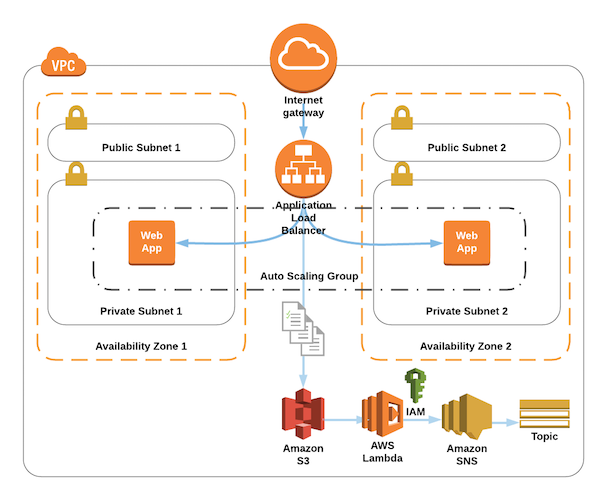

# Read Application Loadbalancer Logs with Lambda

This exercise uses a Lambda Function to react to AWS Application Loadbalancer logs




## How to use

### Get the data

- Use: `svn export https://github.com/DeMoehn/aws-templates/trunk/lambda/lambda-alb-read-logs` to download the folder to a local directory

### Setting up the Lambda

- Go to the Folder *"lambda/"* and open a new Terminal
- Run `npm install` to install all the dependencies of the function

### Package the Lambda Stack

- Go to the Folder *"cloudformation/"* and start a new Terminal
- Because the Lambda Stack uses the Serverless Application Model (SAM) `Transform: AWS::Serverless-2016-10-31`, it needs to be packaged separately
- Replace \<S3_BUCKET> with an existing Bucket that can store the Lambda files (otherwise use `aws s3 mb s3://<S3_LAMBDA_BUCKET>` to create a new one)

```bash
aws cloudformation package --template-file infrastructure.yaml --s3-bucket <S3_BUCKET> --output-template-file packaged-infrastructure.yaml
```

- That´s it, you should get something like *"Successfully packaged artifacts and wrote output template to file packaged-infrastructure.yaml."*

### Package the complete Stack

- Now you need to package the complete, nested Stack
- The Stack consists of a network Stack, a security Stack and an infrastructure Stack.
- Replace \<S3_BUCKET> and run the following commands

```bash
aws cloudformation package --template-file root-stack.yaml --s3-bucket <S3_BUCKET> --output-template-file packaged-root-stack.yaml
```

- Replace <STACK_NAME> with some name for the Stack, <ENVIRONMENT_NAME> with a lowercase (10 char max.) name for the environment and <SNS_MAIL> with an E-Mail adress you'll get notified

```bash
aws cloudformation deploy --stack-name <STACK_NAME> --template-file packaged-root-stack.yaml  --parameter-overrides EnvironmentName=<ENVIRONMENT_NAME> SNSSubMail=<SNS_MAIL> --capabilities CAPABILITY_NAMED_IAM
```

- That's it, after the Stack completed, you should have an Environment with 4 Subnets (2 Public, 2 Private) + 1 IGW, 2 Security Groups, 1 Autoscaling Group + 1 Loadbalancer, 1 S3 Bucket and a Lambda function that sends you a Mail for each new ALB Log,