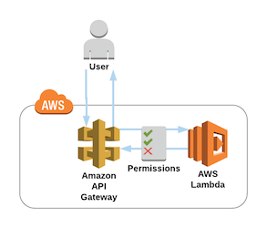

# Lambda and API Gateway

This Sample consists of an AWS API Gateway and a Lambda Function to show how to build a custom API



## Objective

The final solution should be a simple API Endpoint (/) that replies with "Hello from Lambda".

- Create an AWS API Gateway with a simple "/" GET Endpoint that invokes a Lambda Function
  - See: https://docs.aws.amazon.com/apigateway/
  - Use the "API Gateway Proxy integration"
  - See: https://docs.aws.amazon.com/apigateway/latest/developerguide/set-up-lambda-proxy-integrations.html#api-gateway-simple-proxy-for-lambda-output-format
- Create an IAM Role for Lambda Execution
  - See: https://docs.aws.amazon.com/lambda/latest/dg/with-s3-example-create-iam-role.html
- Create a Lambda Function that replies to the API Gateway request
  - See: https://docs.aws.amazon.com/de_de/lambda

## How to use

### Get the data

- Get the complete GitHub Folder with this link: https://github.com/DeMoehn/aws-templates/archive/master.zip
- Or download only this folder with: `svn export https://github.com/DeMoehn/aws-templates/trunk/lambda/lambda-api-gateway` to download the folder to a local directory

### Create the whole Stack

- Package the template (uploads the Skript to S3 and creates a valid CloudFormation template)
- Replace \<S3-BUCKET> with an S3 Bucket where the Script can be stored. You can use `aws s3 mb s3://<S3_BUCKET>` to create a new one

``` bash
aws cloudformation package --template-file template.yaml \
--s3-bucket <S3-BUCKET> \
--output-template-file packaged-template.yaml
```

- Replace: \<STACK_NAME> with your desired Stack name
- Deploy the CloudFormation Template

``` bash
aws cloudformation deploy --stack-name <STACK_NAME> \
--template-file packaged-template.yaml  \
--capabilities CAPABILITY_NAMED_IAM
```

## Do it Step-by-Step

### Create the Lambda Function

- Go to the AWS Lambda Service
- Choose "Create Function"
- Enter a "Name" (e.g. lambda_api-gateway), Choose "Python 3.6" as Runtime and choose "Create an existing role"
- You only need some basic execution right for Lambda if you already have a basic execution role, choose it. If not do the following:
  - Choose "Create a custom role" under "Role" <small>(The custom role creation experience will open in a new tab)</small>
  - A new window with IAM opens, leave everything as is <small>("Create new IAM Role", "lambda_basic_execution")</small> and click "Allow" in the lower right
  - The IAM window closes and the new role should be selcted as "Existing role" in the Lambda configuration
- Now click "Create Function"
- We need to change the response of our Lambda function to make it work with the API Gateway Proxy integration we are going to use later. 
- For a Lambda function's response to be handled the by API Gateway, it must return a response in this format:

```JSON
{
    "isBase64Encoded": true|false,
    "statusCode": httpStatusCode,
    "headers": { "headerName": "headerValue", ... },
    "body": "..."
}
```

- Replace the sample Lambda Python code with the following code:

```python
def lambda_handler(event, context):
    response = {
        "statusCode": 200,
        "body": "Hello from Lambda",
        "isBase64Encoded": "false"
    }
    return response
```

- Save the Lambda function

### Create the API Gateway

- Go to the AWS API Gateway Service
- Click "+ Create API" or "Get Started" <small>(if this is your first API)</small>
- Select "New API"
- Give the API an "API name", a "Description" and keep "Endpoint Type" as "Regional"
- You should now see the configuration page for your new API
- Click "Actions" <small>(right from "Resources")</small> and choose "Create Method"
- Select "GET" as Method and confirm with the small check mark
- Now you can select the GET-Method to see the "/ - GET - Setup" page
- Choose "Lambda Function" as "Integration type"
- Check "Use Lambda proxy integration"
- Choose your region and search for your previously created Lambda function "lambda_api-gateway"
- Press "Save" and accept the "Add Permission to Lambda Function" windows with an "Ok"
- Your API is ready, you just need to deploy it
- Go to "Actions" again <small>(right from "Resources")</small> and choose "Deploy API"
- As "Deployment Stage" choose [New Stage] give it a Name and some Description and click "Deploy"
- You should now see the "Stage Editor" and a blue box on top that says "Invoke URL: <URL>"
- Click the URL, a new window should open and you should see; "Hello from Lambda"
- You just created a GET endpoint for your own API that calls your own Lambda function

### Cleanup

- Delete the Lambda Function
- Delete the API Gateway