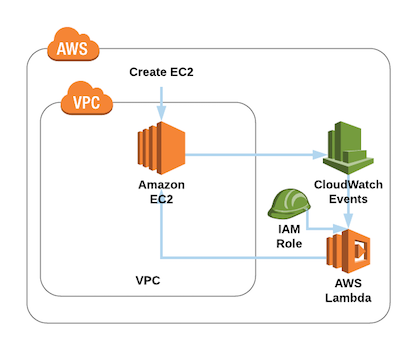

# Tag new EC2 Intance

This Lambda function uses CloudWatch Events to tag newly created EC2 Instance with an "Owner" and a "Launched" Tag.



## Objective

The final solution should be an AWS Lambda Function that tags new EC2 Instances with an "Owner" and a "Launched" Tag.

- Create an IAM Role for Lambda Execution (including permissions to tag EC2 instances)
  - Lambda IAM Role: https://docs.aws.amazon.com/lambda/latest/dg/with-s3-example-create-iam-role.html
  - Tag EC2 Instances: https://docs.aws.amazon.com/AWSEC2/latest/UserGuide/Using_Tags.html
- Create a Lambda Function that tags the EC2 Instances
  - See: https://docs.aws.amazon.com/de_de/lambda
- Use CloudWatch Events to invoke the Lambda Function
  - See: https://docs.aws.amazon.com/lambda/latest/dg/invoking-lambda-function.html#supported-event-source-cloudwatch-events

## How to use

### Get the data

- Get the complete GitHub Folder with this link: https://github.com/DeMoehn/aws-templates/archive/master.zip
- Or download only this folder with: `svn export https://github.com/DeMoehn/aws-templates/trunk/lambda/lambda-api-gateway` to download the folder to a local directory

### Deploy the function

- Package the template (uploads the script to S3 and creates a valid CloudFormation template)
- Replace \<S3-BUCKET> with an S3 Bucket where the Script can be stored. You can use `aws s3 mb s3://<S3_BUCKET>` to create a new one

``` bash
aws cloudformation package --template-file template.yaml \
--s3-bucket <S3-BUCKET> \
--output-template-file packaged-template.yaml
```

- Replace: \<STACK_NAME> with your desired Stack name
- Deploy the CloudFormation Template

``` bash
aws cloudformation deploy --stack-name <STACK_NAME> \
--template-file packaged-template.yaml  \
--capabilities CAPABILITY_NAMED_IAM
```

## Do it Step-by-Step

### Create a new IAM Role

- Login to your AWS Console: https://console.aws.amazon.com
- Go to the AWS IAM Service
- Create a new Role for AWS Lambda, name it something like: "lambda_tag-EC2_role"
- Add the "AWSLambdaBasicExecutionRole" Policy
- Create a new Policy and allow the Creation of EC2 Tags (`Action: 'ec2:CreateTags'`) for any Resource (`Resource: '*'`)
- Add the Policy to the Role ("lambda_tag-EC2_role")

### Create the Lambda

- Go to the AWS Lambda Service
- Choose "Create Function"
- Enter a "Name", Choose "Python 3.6" as Runtime and choose "Create an existing role"
- Now choose the previously created "lambda_tag-EC2_role" as "Existing role"
- Click "Create Function"
- Copy the contents of "index.py" and paste them into the online code editor (replace the content)
- Scroll up to the top and choose "CloudWatch Events" under "Add triggers" (left hand side)
- Configure the trigger, use "Create a new rule"
- Give it a Name and a Description
- As "Rule type" choose "Event pattern"
- Choose "EC2" in the first and "AWS API call via CloudTrail" in the second dropdown
- Click the checkbox on "Operation" under "Detail"
- Search for "RunInstances"
- The "Event pattern preview" should look something like this:

    ``` json
    {
        "source": [
            "aws.ec2"
        ],
        "detail-type": [
            "AWS API Call via CloudTrail"
        ],
        "detail": {
            "eventSource": [
                "ec2.amazonaws.com"
            ],
            "eventName": [
                "RunInstances"
            ]
        }
    }
    ```
- Make sure the Trigger is enabled and click "Add"
- Your Lambda is finished now, click "Save"
- You can now test the Lambda function by creating a new EC2 instance and check if it gets tagged with an "Owner" and "Launched" Tag

### Cleanup

- Delete the Lambda Function
- Delete the IAM Role & the custom policy
- Delete the CloudWatch Event (CloudWatch > Events > Rules)
